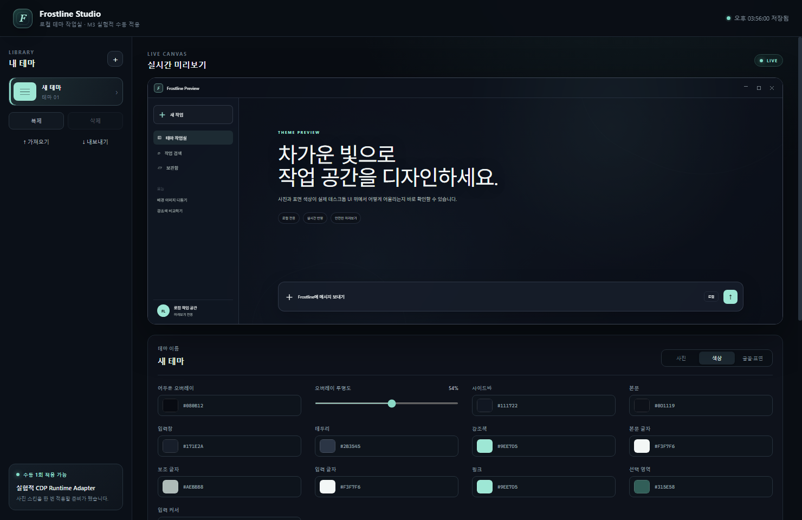

# Frostline Studio

[](https://github.com/gunbread0418/frostline-studio/actions/workflows/ci.yml)
[](https://github.com/gunbread0418/frostline-studio/actions/workflows/package-windows.yml)
[](LICENSE)

Frostline Studio는 사용자가 고른 사진과 색상으로 Codex에서 영감을 받은 데스크톱 테마를 디자인하는 Windows용 Electron 앱입니다. 독립 미리보기와 함께, 사용자가 Codex를 직접 정상 종료한 경우에만 현재 Windows Codex 화면에 사진 스킨을 처음 적용하고 같은 검증된 세션에서 편집값을 바로 갱신하는 실험적 M3 기능을 제공합니다.

> **Unofficial project. Not affiliated with or endorsed by OpenAI.**

## 현재 범위

- M0: 저장소, 아키텍처, 안전 경계, 자동 적용 상태 머신
- M1: 로컬 사진 선택, 테마 편집, 실시간 미리보기, 여러 테마 관리, 안전한 로컬 저장, 가져오기와 내보내기
- M2: 공식 문서와 로컬 설치 상태를 읽기 전용으로 조사하고 연동 경계를 결정
- M3: 사용자 승인 아래 loopback CDP로 최초 적용·세션 내 라이브 갱신·복원하는 실험적 기능. 현재 버전의 회귀 검증 진행 중
- M5: Windows x64 설치 파일, 설치·재실행·제거 검사, SHA-256 체크섬, 공개 빌드 워크플로
- M4: 구현하지 않음. Windows 자동 시작과 자동 적용은 M3 검증 및 별도 승인 뒤에만 진행

## Windows 설치

[GitHub Releases](https://github.com/gunbread0418/frostline-studio/releases)에서 최신 `Frostline-Studio-<version>-Setup-x64.exe`를 내려받아 실행합니다. 현재 설치 파일은 코드 서명 인증서로 서명되지 않았으므로 Windows SmartScreen이 게시자를 확인할 수 없다는 경고를 표시할 수 있습니다. 릴리스의 `SHA256SUMS.txt`로 다운로드한 파일의 SHA-256 값을 확인할 수 있습니다.

설치 프로그램은 현재 Windows 사용자에게만 설치되며 관리자 권한을 요구하지 않습니다. 제거할 때는 예상치 못한 사진·테마 손실을 막기 위해 앱 전용 데이터가 자동으로 삭제되지 않습니다.

## 개발 실행

요구 환경은 Windows 10 이상과 Node.js 24 LTS 24.15 이상입니다.

```powershell
npm.cmd install
npm.cmd run dev
```

PowerShell 실행 정책이 `npm.ps1`을 막는 환경에서도 `npm.cmd`는 시스템 정책을 바꾸지 않고 실행할 수 있습니다.

검증 명령은 다음과 같습니다.

```powershell
npm.cmd run lint
npm.cmd test
npm.cmd run build
npm.cmd run test:smoke
npm.cmd run package:win
```

빌드 뒤 실행하려면 다음 명령을 사용합니다.

```powershell
npm.cmd start
```

`test:smoke`는 실제 Electron을 임시 사용자 데이터 폴더에서 두 번 실행해 main–preload–Renderer 연결과 재실행 뒤 설정 복구를 확인합니다. `package:win`은 x64 NSIS 설치 파일을 만든 뒤 내부 허용 목록과 개인정보 패턴, 임시 설치·재실행·제거를 검사하고 마지막에 SHA-256 체크섬을 생성합니다.

## 주요 기능

- 로컬 사진을 앱 전용 데이터 폴더로 복사
- 배경 위치, 배율, `cover`/`contain`, 밝기, 채도, 대비, 블러 조절
- 오버레이, 사이드바, 본문, 입력창, 카드의 색상과 불투명도 편집
- 본문·보조·입력·링크·선택 영역·입력 커서 색상과 UI·코드 글꼴 편집
- 사진 평균색을 이용한 사진 강조·균형·가독성 우선 추천 팔레트
- 여러 테마 저장, 불러오기, 복제, 삭제
- 사진을 포함한 테마 파일 가져오기와 내보내기
- 앱을 다시 실행해도 선택한 테마와 편집 상태 복구
- 실행 로그와 최근 로컬 작업 결과 표시
- 공개 JSON Schema와 사진 없는 예시 테마
- 공식 Codex `Appearance`에 수동으로 옮길 색상 가이드 복사
- 사용자가 Codex를 직접 종료한 뒤 `127.0.0.1` CDP 세션으로 사진 스킨 최초 적용·복원
- 활성 세션에서 편집값 즉시 반영, 실패 시 잠금, 사용자가 누르는 수동 재연결
- 본문·입력·링크·입력 커서의 WCAG 대비 참고 검사

## 아키텍처

Renderer는 React로 UI와 미리보기만 담당합니다. 파일 선택과 저장은 `contextIsolation: true`, `nodeIntegration: false`인 Electron 환경에서 preload의 제한된 IPC API를 통해서만 요청합니다.

Codex 연동은 `ThemeAdapter` 경계 뒤로 격리했습니다. `PreviewAdapter`는 독립 미리보기만 담당하고, 실험적 `OfficialCodexAdapter`는 Microsoft Store 패키지나 설정 파일을 수정하지 않은 채 확인된 Codex Renderer 하나에 사진과 CSS를 런타임으로 주입합니다. 공식 지원 API가 아니므로 업데이트 호환성을 보장하지 않습니다. `AppServerClientAdapter`는 향후 독립 클라이언트를 검토할 때 사용할 경계입니다. 자세한 내용은 [아키텍처 문서](docs/architecture.md), [M2 조사 결과](docs/integration-research.md), [ADR-0002](docs/adr/0002-loopback-cdp-runtime-skin.md)를 참고하세요.

## 안전 설계

- Codex를 강제 종료하지 않으며 설치 파일, `.codex`, 로그인·채팅 데이터를 읽거나 수정하지 않음
- 개인 사진을 저장소가 아니라 Electron `userData` 아래의 앱 전용 폴더에 복사
- Renderer에 Node.js나 임의 파일 시스템 권한을 노출하지 않음
- 설정을 임시 파일에 쓴 뒤 교체해 중간 저장 실패로 인한 손상 가능성을 줄임
- 개발 서버와 실험적 CDP는 `127.0.0.1`만 사용하고, 무작위 포트의 소유자가 확인된 Codex 패키지인지 검사
- 최초 적용이나 라이브 갱신이 한 번 실패하면 자동 재시도하지 않으며 사용자가 수동으로 다시 눌러야만 새 시도를 시작

자세한 금지 동작과 향후 적용 단계의 조건은 [안전 문서](docs/safety.md)에 정리되어 있습니다.

## 검증 상태

2026-08-13 기준 Windows 환경에서 lint, 9개 파일의 단위·UI 테스트 33개, TypeScript 및 production build를 통과했습니다. M3 테스트에는 수동 종료 요구, 단일 실행, 호환성 프로필, 이미지 디코딩·표시 확인, 실패 후 무재시도, 라이브 갱신과 복원이 포함됩니다. 이전 구현의 실제 Codex 사진 적용은 사용자가 확인했으며, 이번 이미지 레이어와 라이브 갱신 수정본은 새 설치 파일에서 다시 확인해야 합니다. M5 unsigned x64 NSIS 설치 파일의 개인정보 검사, 임시 설치·재실행·제거와 SHA-256 생성도 통과했습니다. 각 검증의 범위는 [테스트 문서](docs/testing.md)에 기록했습니다.

## 알려진 제한

사진 스킨 적용은 OpenAI가 공식 지원하는 확장 API가 아니라 Electron의 CDP 런타임 기능을 제한적으로 사용한 실험적 기능입니다. Codex를 종료하면 주입한 스타일도 사라지고, Codex 업데이트로 DOM이나 실행 인수가 바뀌면 동작하지 않을 수 있습니다. 자동 적용, Windows 자동 시작, 프로세스 이벤트 감지는 구현하지 않았습니다. Windows 설치 파일은 아직 코드 서명이 없어 SmartScreen 평판 경고가 나타날 수 있습니다. 자세한 내용은 [제한 문서](docs/limitations.md)와 [ADR-0002](docs/adr/0002-loopback-cdp-runtime-skin.md)를 참고하세요.

## 스크린샷

아래 이미지는 빈 임시 사용자 데이터와 프로젝트가 직접 만든 기본 테마로 생성했습니다. 개인 사진과 로컬 설정은 포함하지 않습니다.



같은 조건으로 다시 만들려면 다음 명령을 사용합니다.

```powershell
npm.cmd run screenshot
```

## 앱에서 직접 확인할 항목

1. `사진 선택`으로 공개 가능한 테스트 사진을 고른 뒤 원본 파일을 다른 위치로 옮겨도 미리보기가 유지되는지 확인합니다.
2. `Cover`와 `Contain`, 위치, 크기, 밝기, 채도, 대비, 블러가 바로 반영되는지 확인합니다.
3. 색상 탭의 오버레이, 표면색, 여섯 글자 역할의 색상이 미리보기에 반영되는지 확인합니다.
4. 테마 생성, 이름 변경, 복제, 삭제, 가져오기, 내보내기를 확인합니다.
5. 앱을 닫고 다시 실행했을 때 선택한 테마, 사진, 편집값이 복구되는지 확인합니다.
6. `Codex에 적용`을 누르면 실행 중인 Codex를 앱이 종료하지 않고 수동 종료를 요청하는지 확인합니다.
7. GitHub Release의 설치 파일로 현재 사용자 범위에 설치되는지 확인합니다.
8. 설치된 바로가기에서 앱이 실행되고 기존 테마 편집 기능이 같은 방식으로 동작하는지 확인합니다.
9. 제거 프로그램이 앱 본체와 바로가기를 제거하는지 확인합니다.
10. 제거 뒤 다시 설치했을 때 기존 테마가 보존되는지 확인합니다. 개인 데이터를 지우려는 경우에는 앱 전용 데이터 폴더를 사용자가 별도로 삭제해야 합니다.
11. Codex를 직접 정상 종료한 뒤 `Codex에 적용`을 다시 눌렀을 때 창이 한 번만 열리고 사진 스킨이 표시되는지 확인합니다.
12. `복원`을 눌렀을 때 현재 Codex 화면의 Frostline 스타일만 제거되는지 확인합니다.
13. 고의로 실패시킨 뒤 자동 재시도가 발생하지 않고 수동 재시도 안내만 표시되는지 확인합니다.
14. `사진 기반 색상 추천`의 세 모드를 눌렀을 때 사진 평균색과 UI·글자 색상이 함께 바뀌는지 확인합니다.
15. `글꼴·표면`에서 UI 글꼴, 코드 글꼴, 글자 크기와 네 표면 불투명도가 미리보기와 실제 Codex에서 비슷하게 보이는지 확인합니다.
16. 실제 Codex에 적용된 상태에서 슬라이더를 바꾸면 별도의 종료·재실행 없이 바로 반영되는지 확인합니다.
17. 라이브 갱신을 일시정지하면 변경값이 Codex에는 반영되지 않고 Frostline 미리보기에만 반영되는지 확인합니다.
18. `라이브 연결 다시 시작`을 누르면 현재 편집값이 한 번 반영되는지 확인합니다.
19. 흰색 입력창을 선택해도 입력 글자와 깜빡이는 입력 커서가 보이고 마우스 포인터가 텍스트 커서로 표시되는지 확인합니다.
20. 적용 실패 로그에 `단계/진단 코드`가 표시되고 자동 재시도가 발생하지 않는지 확인합니다.

사용자 확인 결과: 2026-08-12에 기존 M1 항목 1~6이 모두 정상 작동했습니다. 7~10번은 자동 설치 테스트를 통과했으며 실제 Windows 바탕 화면과 제거 UI를 사용하는 수동 확인이 남아 있습니다. 2026-08-13에는 실제 Codex 사진 적용과 복원 결과를 확인했고, 첫 적용 판정이 간헐적으로 실패하는 현상과 입력 커서 가독성 문제를 발견했습니다. 이번 수정본의 항목 14~20은 새 실행 파일에서 직접 확인해야 합니다.

## 오픈소스 참여

버그 보고와 기능 제안은 GitHub issue 양식을 사용합니다. 코드 변경 전에는 [기여 지침](CONTRIBUTING.md), 보안 문제는 [보안 정책](SECURITY.md), 참여 규칙은 [행동 규범](CODE_OF_CONDUCT.md)을 확인하세요. 테마 파일 형식은 [공개 Schema](schemas/frostline-theme.schema.json)와 [작성 지침](docs/theme-format.md)에 정리되어 있습니다.

현재 계획과 완료 조건은 [ROADMAP.md](ROADMAP.md), 버전별 변경은 [CHANGELOG.md](CHANGELOG.md)에서 확인할 수 있습니다.

## 라이선스

소스 코드는 [MIT License](LICENSE)로 배포합니다. 외부 라이브러리와 사용자가 선택한 사진은 각각의 권리와 라이선스를 따릅니다. MIT 라이선스는 OpenAI 또는 Codex 상표 사용 권리를 부여하지 않습니다.
